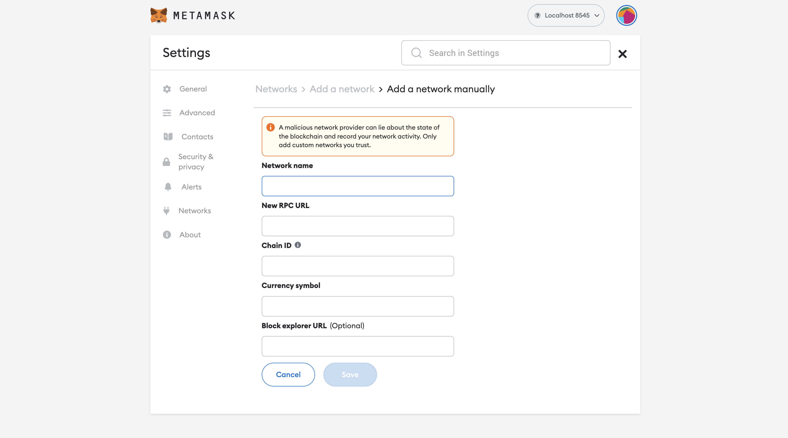
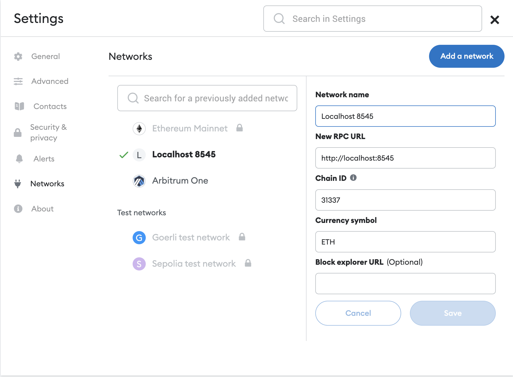
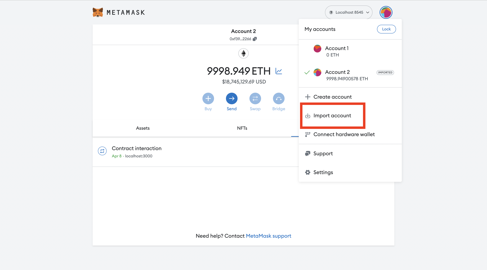

# kuru-contracts
Contracts for portfolio lending using perpetuals

## Setup
1. To download and install `node` and `npm` visit https://nodejs.org/en/download

2. To install node dependencies, run:
```
npm i
```

3. To setup a local hardhat fork of arbitrum, run:
```
npx hardhat node --fork https://arb1.arbitrum.io/rpc
```

4. Download and connect metamask to local hardhat network.\
4.1. If you don't have metamask extension installed, download and install the extension from [here](https://metamask.io/download/).\
4.2. Add local hardhat network to metamask.
\
4.3. The network configuration for the local hardhat node is:
\
4.4. Import a hardhat user into the metamask wallet as it has 


5. Initialise the forked hardhat local state with the kuru contracts. This scrip achieves the following:\
5.1. Deploy our smart contracts to local fork. \
5.2. Create an ETH long position with 0.05 eth collateral. \
5.3. Execute that long by spoofing like the smartcontrat.
```
npx hardhat run --network localhost scripts/initConfig.js
```

6. Once this is done you can add USDC funds to the lending contract by running
```
npx hardhat run --network localhost scripts/sendUsdcToLending.js
```

7. Access the [app](https://kuru-fi.vercel.app/) and hit launch app.
